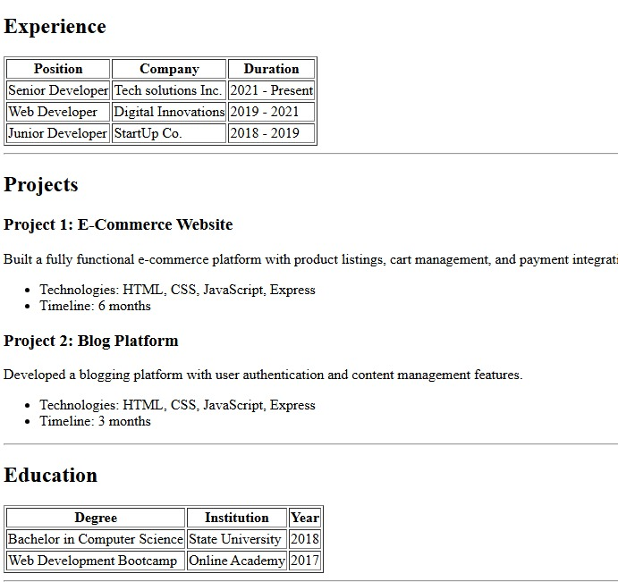

# Resume Website (HTML Only)

A simple personal resume website built using only HTML.

## 🚀 Setup

1. Download or clone the repo
2. Open `index.html` in your browser

OR use Live Server in VS Code.

## 💻 Usage

Edit `index.html` and replace the placeholder content with your own:
- Name
- Skills
- Experience
- Projects
- Contact details

## 📸 Screenshots





## 🌐 Live Demo 

https://sanjeevdev905.github.io/Resume/

## 🛠 Tech Used

- HTML5

## 📁 Folder Structure

```
.
├── index.html
├── README.md
└── screenshots/
```

## Author

Sanjeev Singh
